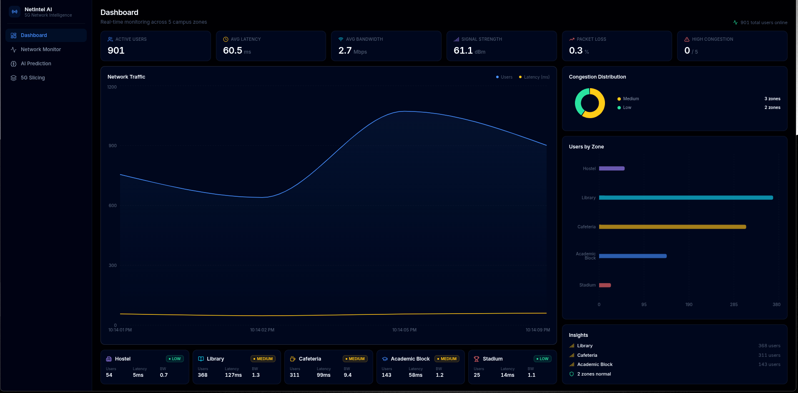
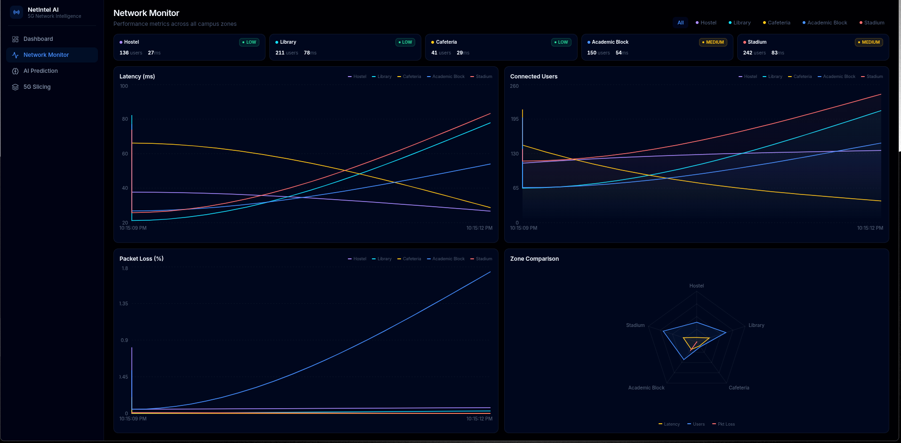
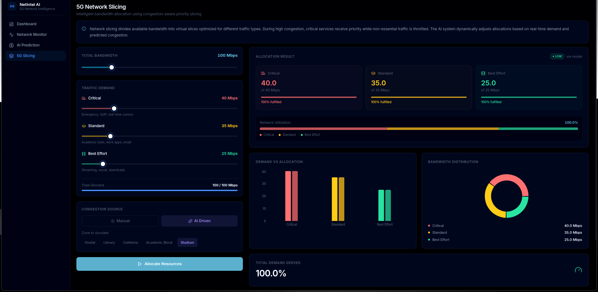

# AI Network System

AI-driven network intelligence for high-density environments.

## Project Structure
- `backend/` - Team 2 FastAPI API and slicing decision engine
- `model/` - Team 1 labeling, training, and prediction modules
- `simulation/` - Team 1 simulation module
- `docs/` - project handoff notes and quick guides

## Problem
In places like colleges, stadiums, and public events, many users connect at once.
This causes latency, unstable connectivity, and poor service for critical communication.

## Solution
This project combines:
- Simulation of network conditions
- AI-based prediction using Team 1 model
- Intelligent bandwidth allocation using 5G slicing logic

## Team 2 Backend (Krishna)
The backend service adds these APIs:
- `POST /simulate`
- `POST /predict`
- `POST /allocate`
- `GET /health`

## Setup
```bash
python -m venv .venv
.venv\Scripts\activate
pip install -r requirements.txt
```

## Run
```bash
uvicorn backend.app:app --reload --host 0.0.0.0 --port 8000
```

Open docs at:
- `http://127.0.0.1:8000/docs`

Detailed handoff document:
- `docs/read-this-first.md`

## Model Integration
Team 1 output model should be available at:
- `model/model.pkl`

Optional custom path:
```bash
set MODEL_PATH=D:\path\to\model.pkl
```

If the model is unavailable or fails at runtime, prediction uses heuristic fallback so demo still works.

## API Quick Examples
### Simulate
```bash
curl -X POST "http://127.0.0.1:8000/simulate" -H "Content-Type: application/json" -d "{}"
```

### Predict
```bash
curl -X POST "http://127.0.0.1:8000/predict" -H "Content-Type: application/json" -d "{\"zone\":\"Stadium\",\"signal_strength\":56,\"bandwidth_usage\":7.2,\"latency\":180,\"packet_loss\":3.1,\"num_users_in_zone\":250,\"time_of_day\":20}"
```

### Allocate (manual label)
```bash
curl -X POST "http://127.0.0.1:8000/allocate" -H "Content-Type: application/json" -d "{\"total_bandwidth_mbps\":1000,\"congestion_label\":\"HIGH\",\"demand_mbps\":{\"high_priority_mbps\":600,\"medium_priority_mbps\":450,\"low_priority_mbps\":400}}"
```

### Allocate (prediction-assisted)
```bash
curl -X POST "http://127.0.0.1:8000/allocate" -H "Content-Type: application/json" -d "{\"total_bandwidth_mbps\":1000,\"demand_mbps\":{\"high_priority_mbps\":520,\"medium_priority_mbps\":340,\"low_priority_mbps\":280},\"prediction_features\":{\"zone\":\"Academic_Block\",\"signal_strength\":60,\"bandwidth_usage\":6.5,\"latency\":140,\"packet_loss\":2.2,\"num_users_in_zone\":210,\"time_of_day\":18}}"
```

## Reality Statement
This system simulates network behavior and provides AI decision support.
It does not directly control real telecom infrastructure.

## Frontend Interface (Team 3)
A modern, real-time React dashboard has been integrated to visualize the network traffic, run AI predictions, and execute 5G slicing logic interactively.

### Network Monitoring & Dashboard


### AI Congestion Prediction


### 5G Slicing Allocator

